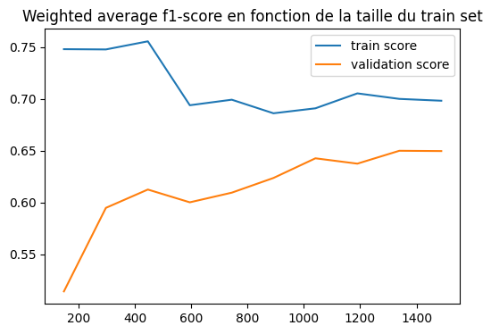
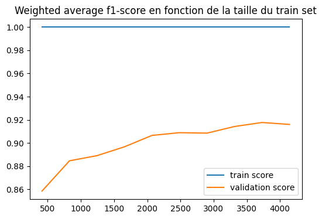

# Projet Fifa : partie 3

Auteur : DECOMBLE Simon

Dans ce rapport, nous étudions la prédiction du salaire et de la valeur des joueurs de football masculins. Nous abordons le problème sous l'angle d'un problème de classification (type de salaire : bas, moyen, élevé) puis de la régression : prédiction de la valeur numérique.  

Nous restreignons ensuite l'étude aux joueurs français pour trouver des similitudes et divergences avec les modèles globaux précédents; puis, nous étudions l'impact de quelques caractéristiques sur la qualité de prédiction de la valeur des joueurs.

## 0.a Dernière étape de cleaning, la gestion des NaN

Cette étape n'a pas été traité dans la partie précédente bien qu'elle aurait dû l'être.  
On cherche à supprimer tous les NaN du dataset, en les remplaçant ou en supprimant les lignes qui en comportent s'il y en a peu.  
On identifie d'abord les colonnes où il y en a :

    club_team_id : 61 NaN
    league_level : 61 NaN
    nation_team_id : 18480 NaN
    pace : 2132 NaN
    shooting : 2132 NaN
    passing : 2132 NaN
    dribbling : 2132 NaN
    defending : 2132 NaN
    physic : 2132 NaN
    goalkeeping_speed : 17107 NaN
    value_eur : 74 NaN
    wage_eur : 61 NaN

On étudie de plus près le nombre de joueurs de chaque type :

    Il y a 2132 goals et 17107 joueurs non goal

En regardant le nombre de NaN pour certaines colonnes et le nombre de goals/non-goals, on remarque que certaines statistiques ne sont pas définies pour les goals et qu'une statistique ("goalkeeeping_speed") n'est pas définie pour les non goals.  
Ainsi, puisque ce sont des attributs flottants, il est peut-être judicieux de remplacer ces NaN par la valeur 0. Il existe un risque pour que cela fausse le modèle, mais puisque cette valeur de 0 sera corrélée à la position du joueur, il est probable que cela ne fasse que dupliquer l'information dans ces cas-ci. On opte donc pour cette option. 

Les NaN restants sont les suivants :

    club_team_id : 61 NaN
    league_level : 61 NaN
    nation_team_id : 18480 NaN
    value_eur : 74 NaN
    wage_eur : 61 NaN

On a bien remplacés les NaN des colonnes visées par des 0.

Ensuite, nous avons plus de 18 000 NaN (sur 19 200 joueurs environ en tout) pour le nation_team_id. De plus, c'est une colonne qui ne nous apporte pas énormément d'information sachant que nous avons la nationalité du joueur et que cela est fortement corrélé avec son équipe nationale. Ainsi, la solution la plus simple sans perdre trop d'information est de retirer cette colonne.

    club_team_id : 61 NaN
    league_level : 61 NaN
    value_eur : 74 NaN
    wage_eur : 61 NaN

Enfin, il reste des NaN pour les valeurs d'id de club qu'on ne peut inférer, comme il y en a peu, on supprime les lignes concernées (61 lignes / 19 239, négligeable). Idem pour league_level.

On regarde le nombre de NaN restants :

    value_eur : 13 NaN

Il reste 13 NaN pour les valeurs des joueurs, on remplace par la moyenne des valeurs de tous les joueurs.

Il n'y a ensuite plus de valeur non renseignée, on peut donc sauvegarder ce dataset qui servira de base à ceux utilisés pour les entraînements. On supprime l'id sofifa des features et on le met en index du dataframe.

## 0.b. Importation et préparation à la prédiction

Pour prédire les informations concernant les valeurs / salaires, on supprimera les autres colonnes qui font état de ces informations (de manière discrète ou continue).

On encode manuellement les catégories en nombres entiers (car il n'y a que 3 colonnes concernées).

## 1. Salaire d'un joueur

### 1.a. Prédiction de la catégorie de salaire

#### Préparation 

On regarde la répartition des catégories à prédire.
    

    

On remarque que les classes sont très déséquilibrées, on utilise donc le module imbalanced-learn, extension de scikit-learn.  
On utilise NearMiss pour resampler nos données et avoir un dataset plus équilibré.

Après traitement, la répartion est équitable (au prix de la volumétrie mais en portant le maximum d'informations pertinentes de la classe majoritaire) :
    
    

Nombre de ligne du dataset équilibré :

    (2778,)

Avant équilibrage :

    (19178,)

On a fortement divisé la taille du dataset (presque par 10), mais le NearMiss a gardé les points les plus pertinents dans la plus large classe. On essaye donc de travailler tout de même avec ce dataset réduit. Il faut faire ce choix, ou alors celui de travailler avec un dataset déséquilibré. Ici, nous préférons l'option qui réduit le nombre de points d'exemple.

#### Entraînement et Evaluation

    == SVC ==

    

    

                  precision    recall  f1-score   support
    
               0       0.38      0.91      0.53       301
               1       0.00      0.00      0.00       312
               2       0.45      0.28      0.35       304
    
        accuracy                           0.39       917
       macro avg       0.28      0.40      0.29       917
    weighted avg       0.27      0.39      0.29       917
    

    

**Interprétation (SVC):** Nous avons testé ce modèle car il s'agit d'un classique pour une tâche de classification comme celle-ci.  
Cependant, le modèle est très inefficace pour notre tâche, où alors il nécessite des hyperparamètres plus adaptés.  
Il fait beaucoup d'erreurs et prédit en majorité la classe 0 (d'où le bon rappel pour cette classe), jamais la classe 1, et parfois la classe 2, mais pas majoritairement quand il le faut.  
Le classifieur semble donner des résultats naïfs, et ne fait pas beaucoup mieux que le hasard (accuracy de 0.39).  
Ce modèle ne semble pas adapté.

    == RandomForest ==

    

    

                  precision    recall  f1-score   support
    
               0       0.68      0.80      0.74       301
               1       0.71      0.61      0.65       312
               2       0.52      0.51      0.52       304
    
        accuracy                           0.64       917
       macro avg       0.64      0.64      0.64       917
    weighted avg       0.64      0.64      0.64       917
    

    

    
**Interprétation (Random Forest):** Le choix de la random forest s'explique par son efficacité due à la sagesse des foules (ou plutôt des forêts ici). En effet, nous avons de meilleurs résultats et nous prédisons en majorité la bonne classe pour chacune d'entre elle. Cependant, il existe tout de même un certain nombre d'erreurs qui sont commises, et ceci pour les trois classes. L'accuracy est tout même quasiment le double du modèle précédent. Ce qui augure du bon pour la suite concernant ce modèle.  
Les courbes d'apprentissage nous montrent que le modèle overfitte beaucoup, ce qui est souvent le cas pour une random forest avec peu de données. En effet, la courbe de train reste à 1, tandis que la courbe de test peine à augmenter.  

    == AdaBoost ==

    

    

                  precision    recall  f1-score   support
    
               0       0.73      0.74      0.73       301
               1       0.79      0.71      0.74       312
               2       0.57      0.62      0.60       304
    
        accuracy                           0.69       917
       macro avg       0.70      0.69      0.69       917
    weighted avg       0.70      0.69      0.69       917
    

    

    

**Interprétation (AdaBoost) :** C'est pour ce modèle que les résultats sont les meilleurs, nous prédisons la bonne classe en majorité et il y a moins d'hésitations pour ce modèle sauf pour la classe 2. L'accuracy est quasiment de 0.7, les f1-scores sont tous au dessus de 0.6 (le pire étant pour la classe 2 comme évoqué).  
Les courbes d'apprentissage ont une allure très satisfaisant, le modèle overfitte de moins en moins et augmente sa qualité de prédiction à mesure qu'on augmente le train set. Il faudrait donc idéalement plus de données pour améliorer encore les performances. Autrement, on pourrait chercher à trouver les meilleurs hyperparamètres, c'est ce que nous allons faire dans la suite.

Il est important de relever le biais majeur qui est que nous avons peu de données dans cette partie de classification, puisque nous avons équilibré le dataset et qu'il y avait une classe extrêmement majoritaire. Ce problème ne se rencontrera pas dans la partie régression. Toutefois, malgré ce faible nombre de données, la learning curve d'Adaboost (avec paramètres par défaut) semble plutôt satisfaisante, même si le score doit évidemment être augmenté.

#### Optimisation

On va essayer ici d'optimiser d'avantage l' AdaBoost, via un RandomSearch.

Le meilleur estimateur que nous avons obtenu est le suivant :

    {'n_estimators': 450, 'learning_rate': 1.0, 'algorithm': 'SAMME'}

Résultats :

    

    

                  precision    recall  f1-score   support
    
               0       0.75      0.76      0.76       301
               1       0.78      0.71      0.75       312
               2       0.59      0.64      0.61       304
    
        accuracy                           0.71       917
       macro avg       0.71      0.71      0.71       917
    weighted avg       0.71      0.71      0.71       917
    

    

    

Avec l'optimisation d'AdaBoost via le RandomSearch, nous avons légèrement augmenté les performances du modèle. Au prix d'un temps de calcul plus long. Nos métriques ont gagné quelques points, notamment l'accuracy est passée de 0.69 à 0.71.  
On pourrait encore augmenter ces performances en raffinant d'avantage la recherche des meilleurs hyperparamètres, mais aussi à l'étape du préprocessing en ne gardant que des features décorellées.  
De plus, il s'agit peut-être également d'un tâche délicate dont nous ne pouvons tirer des scores excellent (au-delà de 0.8, 0.9).

### 1.b Prédiction de la valeur du salaire

Nous faisons face à une tâche de régression cette fois. Nous n'avons donc pas à tenir compte de l'équilibre des classes et pouvons donc utiliser l'intégralité du dataset.

Nous évaluons de manière analogue 3 modèles de régression linéaire (RANSAC, RandomForest, Adaboost), mais avec des métriques différentes nécessairement : la Mean Square Error (MSE), la Mean Absolute Error (MAE) et le coefficient de détermination R². Ces métriques sont calculées sur **le jeu de test** (ce sera toujours le cas pour la suite en régression).

    == RANSAC ==
     MSE = 484725335.5809108
     MAE = 9044.310229942492
     Coefficient R² = -0.20226813796408716
    
    == RandomForest ==
     MSE = 484412020.71728647
     MAE = 9041.306688260389
     Coefficient R² = -0.20149102059465007
    
    == AdaBoost ==
     MSE = 484361267.0315042
     MAE = 9029.583619744679
     Coefficient R² = -0.20136513582069426
    

Les résultats sont très mauvais, pour tous les modèles, on garde le RANSAC et on rajoute des features polynomiales, mais d'abord, il est nécessaire de diminuer la volumétrie des features, on ne va garder que les features numériques décorrellées (extraites dans la partie 1) avec les catégorielles (encodées).  
Il s'agit des suivantes :

    'mentality_penalties attacking_heading_accuracy skill_moves mentality_aggression power_stamina BMI skill_long_passing physic goalkeeping_positioning overall attacking_crossing movement_reactions goalkeeping_kicking mentality_composure gk skill_curve potential goalkeeping_diving power_shot_power goalkeeping_reflexes attacking_volleys goalkeeping_handling power_strength movement_agility rwb movement_balance weak_foot power_jumping attacking_finishing pace skill_fk_accuracy lf'

Nous définissons une pipeline avec création de features polynomiales (degré 2 pour limiter les coût de calcul et faire au plus simple d'abord).  

Résultats du R² du RANSAC suite à cette réduction de dimension :

    -15.60658485379313

C'est pire, il y a probablement un problème, avec la pipeline ou la métrique (potentellement inadaptée ici).

On réitère avec cette fois le modèle de régression Random Forest, nous obtenons le coefficient R² suivant :   

    0.815255007799976

Les résultats de régression sont beaucoup mieux et très satisfaisant en utilisant uniquement les features décorellées et le degré 2 et une Random Forest de 100 arbres. Un R2 de 0.81 est très bien pour notre tâche, surtout au vu du score très mauvais obtenu par le RANSAC simple.

## 2. Valeur d'un joueur

### 2.a Prédiction de la catégorie de valeur

#### Préparation 

On applique la même démarche qu'en 1.a.

    

    

Après rééquilibrage et suppression des lignes de la classe unknown :

    

    

Nombre de lignes après équilibrage :

    (7731,)

Avant équilibrage :

    (19165,)

#### Entraînement et Evaluation

    == SVC ==

    

    

                  precision    recall  f1-score   support
    
               0       0.36      0.81      0.50       876
               1       0.10      0.00      0.00       832
               2       0.48      0.32      0.38       844
    
        accuracy                           0.38      2552
       macro avg       0.31      0.37      0.29      2552
    weighted avg       0.31      0.38      0.30      2552
    

    

    
**Interprétation (SVC) :** Mêmes remarques que pour la prédiction de la catégorie de salaire, excepté que les résultats sont légèrement meilleurs.

    == RandomForest ==

    

    

                  precision    recall  f1-score   support
    
               0       0.92      0.95      0.94       876
               1       0.98      0.90      0.94       832
               2       0.87      0.91      0.89       844
    
        accuracy                           0.92      2552
       macro avg       0.92      0.92      0.92      2552
    weighted avg       0.92      0.92      0.92      2552
    

    

    
**Interprétation (Random Forest) :** Ce modèle est très performant pour la prédiction de catégorie de valeur, beaucoup plus que pour le salaire. On atteint un f1-score très satisfaisant pour toutes les classes, la matrice de confusion nous montre visuellement très rapidement que ce modèle fait de l'excellent travail.  
L'accuracy est de 0.86, ce qui est très bien pour un modèle avec les hyperparamètres par défaut. On pourrait chercher à augmenter encore ce score par optimisation, mais on ne le fera pas ici. La courbe d'apprentissage est très satisfaisante (la random forest overfit beaucoup mais c'est un attendu pour ce type de modèle, avec ce nombre de données).

    == AdaBoost ==

    

    

                  precision    recall  f1-score   support
    
               0       0.92      0.92      0.92       876
               1       0.96      0.42      0.59       832
               2       0.58      0.90      0.70       844
    
        accuracy                           0.75      2552
       macro avg       0.82      0.75      0.74      2552
    weighted avg       0.82      0.75      0.74      2552
    

    

    

**Interpréation (AdaBoost) :** Le modèle est moins efficace que pour la prédiction de salaire, et le modèle de Random Forest permet d'obtenir de meilleurs résultats. Dans ce dernier, on a peu de confusion entre classes alors qu'ici on voit que le f-score est inférieur pour les trois classes. Le modèle fait plus de confusions : notamment, il prédit régulièrement à tort la classe 2 au lieu de la classe 1. La courbe d'apprentissage semble erratique contrairement à l'étude de classification précédente.

Pour la prédiction de valeur, on peut donc se tourner vers un modèle de Random Forest, qu'on pourrait éventuellement optimiser d'avantage.

### 2.b Prédiction de la valeur

Tout comme en partie 1.b, il semble judicieux de réduire la dimensionalité de notre dataset pour améliorer les performances et les résultats de notre modèle. On va ne garder que les features catégorielles et numériques décorrelées et créé des features polynomiales de degré 2.

Coefficient R² pour le régresseur RANSAC :

    -5.079955421093522

Coefficient de détermination R² pour le régresseur Random Forest (100 arbres) :

    0.9474168392102332

Les résultats sont très très bons pour le régresseur Random Forest dans la prédiction de la valeur des joueurs (R² de 0.947). Il semble donc possible de prédire efficacement cette quantité à partir des attributs décorrellés que nous avons gardés.

## 3. Caractéristiques des joueur internationaux vs. joueurs français

Est-ce que ce qui rend un joueur cher rend un français cher ?  

Pour répondre à cette question, on prend le modèle de la partie 2.b qui prédit la valeur d'un joueur (entraîné sur un certain nombre de joueurs de différentes nationalités), et on entraîne un modèle similaire entraîné uniquement sur les joueurs français. Ensuite, on compare les prédictions sur les joueurs de test.

    

    

    

On remarque qu'il y a des écarts assez importants pour certains éléments du jeu de test, il y a donc a priori des critères qui varient pour estimer qu'un joueur international est cher, et qu'un joueur français l'est. Cependant, on a aussi beaucoup d'exemples où l'écart est faible en terme de prédiction pour les deux modèles. Il y a donc tout de même de nombreuses caractéristiques communes pour estimer qu'un joueur a de la valeur, indépendamment de sa nationalité française.  

Il est bon de notifier un biais majeur : dans le cas du modèle fitté sur les joueurs français, il y a beaucoup moins d'exemples (1000 donc 10 fois moins) que pour l'entraînement de l'autre modèle. Ce qui le rend beaucoup moins précis dans ce qu'il cherche à approximer (i.e. la fonction réelle qui estime la valeur d'un français).

## 4. Sélection par rapport à un faible nombre d'attributs

Un décideur vous dit qu’il ne sélectionne les joueurs que par rapport à Overall
Ratings, Wage, International Reputation, Weak Foot et Skill Moves. Que pouvez-vous
lui dire par rapport à vos différents tests de prédiction ?  

Pour répondre à cette question, nous allons entraîner un modèle (du type de celui en 2b) pour prédire la valeur d'un joueur, mais entraîné uniquement avec les features citées ci-dessus.

Coefficient de détermination R² sur le jeu d'entraînement du modèle entraîné avec les 5 features d'intérêt :

    0.8297702572246931

En n'utilisant que ces 5 attributs, nous arrivons tout de même à avoir un coefficient R² de 0.83. Ce qui est une très bonne performance.  
Ce test semble donc montrer que l'utilisation seule de ces 5 attributs peut suffire à estimer de manière correcte la valeur d'un joueur. Cependant, pour gagner en précision, il est préférable d'utiliser d'autres features comme la trentaine utilisée précédemment avec le modèle en 2.b qui a permis d'atteindre un R² de presque 0.95.  

C'est en tout cas un très bon choix de features si l'on devait n'en choisir que très peu.  
Il existe tout de même le biais de corrélation très probable entre le salaire et la valeur (cf. partie 1 et 2 de l'étude) : le salaire doit aider fortement à l'estimation de la valeur.  

## Conclusions

La prédiction des catégorie de salaire et de valeur semble possible et plutôt fiable, bien que le déséquilibre implique un ensemble d'entraînement beaucoup plus restreint. Les modèles AdaBoost et de Random Forest, bien hyperparamétrés, semblent adéquat pour ces tâches.  

La prédiction de la valeur numérique du salaire des joueurs semble assez complexe, nécessite un préprocessing qui garde des features décorrellées au maximum et la génération d'attributs polynomiaux. Les résultats sont ensuite plutôt satisfaisant avec un régresseur de type forêt aléatoire.  

La prédiction de la valeur des joueurs répond aux même critères et fournit des résultats encore meilleurs, et très satisfaisants.  

Les critères qui font la valeur des joueurs français semblent proches de ceux qui font la valeur des joueurs à l'internationale, mais il existe un biais lié aux volumétries différentes lors de l'entraînement, qui nous pousse à rester prudent quant à ces affirmations.  

Le choix des 5 features évoquées par un décideur semble pertinent pour prédire rapidement la valeur d'un joueur. Mais, il peut être raffiné en ajoutant d'avantage d'attributs, si la sélection doit être d'une plus haute exigence.
